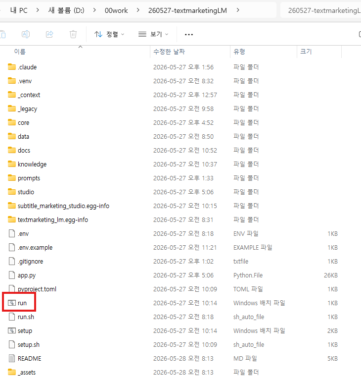
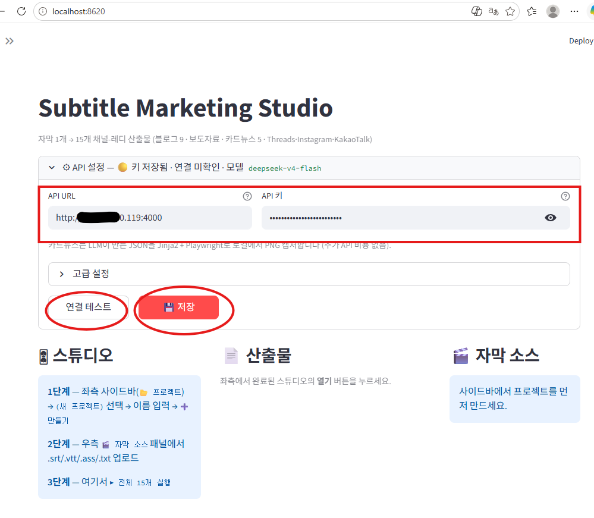
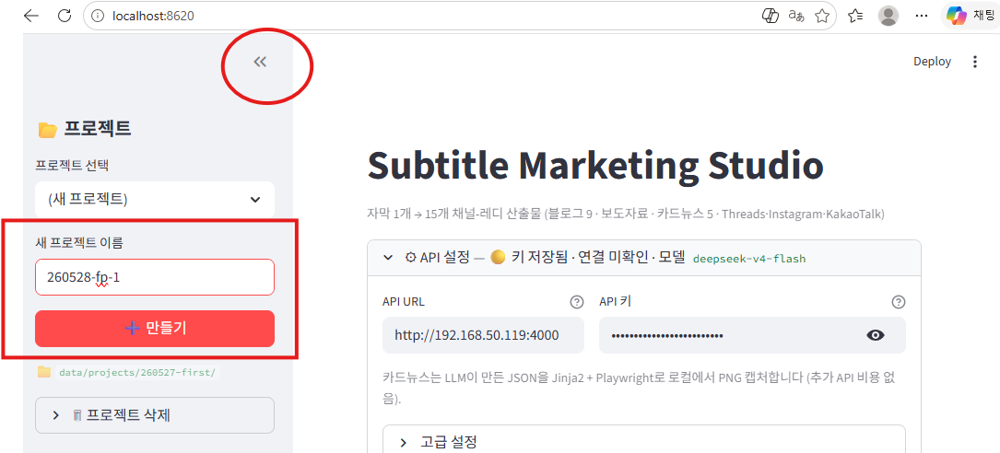
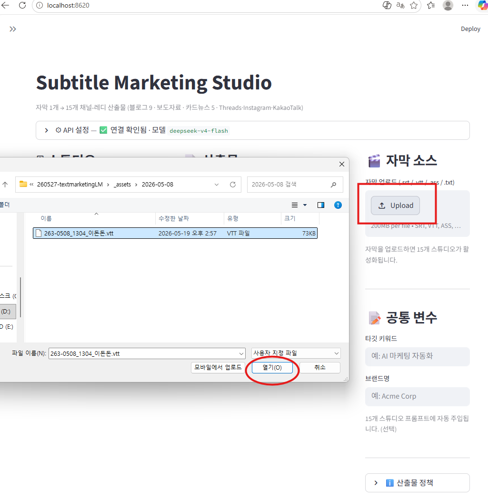
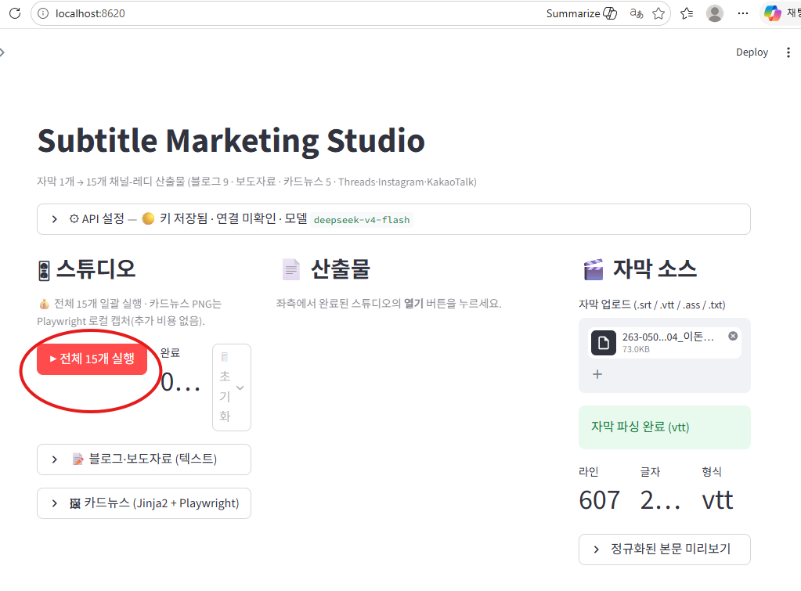
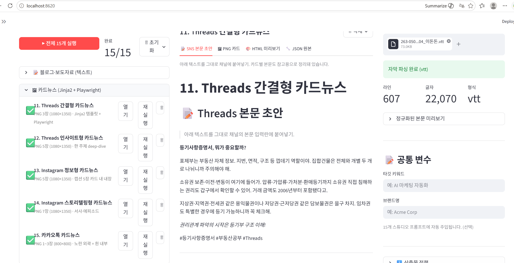
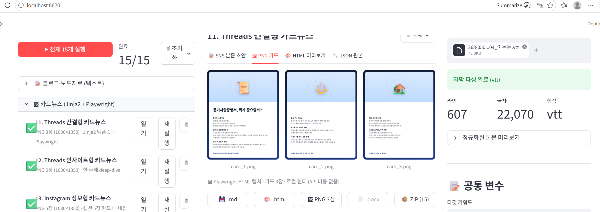

# Subtitle Marketing Studio

자막 파일 1개 → **15개 채널-레디 산출물** (블로그 9종 · 보도자료 · Threads · Instagram · KakaoTalk 카드뉴스)

## 시작하기 (Windows)

1. **`setup.bat`** 더블클릭 — 한 번만
2. **`run.bat`** 더블클릭 — http://localhost:8620 열림

## 사용법

화면은 **3-컬럼**(좌: 스튜디오 / 중앙: 산출물 / 우: 자막 소스) + **사이드바(⚙)** 구성. 처음이면 사이드바가 접혀있을 수 있어요. 좌상단 `»` 버튼으로 펼치세요.

### 1단계 — 상단 `⚙ API 설정` 펼치기

타이틀 바로 아래 회색 막대를 클릭하면 펼쳐집니다.
- **API URL**: `http://192.168.50.119:4000` (기본값, 사내 프록시)
- **API 키**: 사내 LiteLLM 대시보드(`http://192.168.50.119:4000/ui/`)에서 발급받은 `sk-…` 키
- **연결 테스트** → ✅ → **💾 저장**

저장 후엔 막대가 자동으로 접히고 ✅ 배지가 뜹니다. 모델은 `deepseek-v4-flash` 고정.

### 2단계 — 좌측 사이드바에서 프로젝트 만들기

사이드바 `📂 프로젝트` → `(새 프로젝트)` → 이름 입력 (예: `youtube-ep01`) → **➕ 만들기**.

### 3단계 — 우측에서 자막 업로드 + 공통 변수 입력

**우측 🎬 자막 소스** 패널에서:
- `.srt` / `.vtt` / `.ass` / `.txt` 드래그&드롭 → 라인·글자 수 확인
- (선택) **공통 변수**에 타깃 키워드·브랜드명 입력 → 15개 프롬프트에 자동 주입

### 4단계 — 좌측에서 15개 일괄 생성

**좌측 🎛 스튜디오** 패널의 **▶ 전체 15개 실행** 클릭. 진행률 바가 차고 카드가 하나씩 ✅로 (~2~4분, 병렬 4).

카드뉴스 PNG는 **Playwright 로컬 캡처**(추가 비용 없음). 블로그 10종은 텍스트 LLM 호출만 사용.

### 5단계 — 결과 확인·다운로드

- 카드의 **📄** 버튼 → 중앙 패널에 미리보기·HTML·PNG·JSON 탭으로 표시
- **🔄** 버튼 → 그 스튜디오만 다시 생성 (톤이 마음에 안 들 때)

- 중앙 패널의 **.md / .html / 🖼 PNG / 📄 .docx / 📦 ZIP** 버튼으로 추출

카드뉴스 스튜디오의 `.md` 파일에는 **SNS 본문 초안**이 들어가 있어 그대로 채널 텍스트 입력란에 붙여넣기 가능. 보도자료는 `.docx`로 다운받아 기자 메일 첨부.

산출물은 `data/projects/<프로젝트>/<NN_studio_key>/output.md` 에도 자동 저장됩니다. 앱을 닫았다 다시 열어도 같은 프로젝트를 선택하면 결과가 그대로 복원됩니다.

## 15개 스튜디오 라인업

**📝 블로그·보도자료 (텍스트, 1~10)**
| # | 스튜디오 | 길이 | 타깃 |
|---|---|---|---|
| 01 | 블로그 네이버 정보형 | 2,500자 | 네이버 블로그 |
| 02 | 블로그 네이버 일상형 | 1,500자 | 네이버 블로그 |
| 03 | 블로그 네이버 리뷰형 | 2,000자 | 네이버 블로그 |
| 04 | 블로그 티스토리 SEO형 | 3,500자 | 티스토리 |
| 05 | 블로그 Medium 에세이형 | 2,500자 | Medium |
| 06 | 블로그 브런치 감성형 | 2,500자 | 브런치 |
| 07 | 블로그 개인 기술블로그 회고형 | 1,500자 | 개인 블로그 |
| 08 | 블로그 칼럼 시사형 | 2,500자 | 브런치 / 시사 매체 |
| 09 | 블로그 워드프레스 영문 SEO | ~3,000 words | WordPress (영문) |
| 10 | 보도자료 | 800~1,500자 | **DOCX**, 기자 메일 첨부 |

**🖼 카드뉴스 — Jinja2 + Playwright (11~15)**
| # | 스튜디오 | 카드 수 | 사이즈 |
|---|---|---|---|
| 11 | Threads 간결형 카드뉴스 | 3장 | 1080×1350 |
| 12 | Threads 인사이트형 카드뉴스 | 5장 | 1080×1350 |
| 13 | Instagram 정보형 카드뉴스 | 5장 | 1080×1350 |
| 14 | Instagram 스토리텔링형 카드뉴스 | 7장 | 1080×1350 |
| 15 | 카카오톡 카드뉴스 | 1~3장 | 800×800 |

## 더 보기

- [docs/setup.md](docs/setup.md) — macOS/Linux 설치, API 설정 상세, 폴더 구조, 모델 변경
- [docs/cost.md](docs/cost.md) — 비용 안내 (자막 1개 ≈ 1,350원), 환율 갱신 방법
- [docs/output-policy.md](docs/output-policy.md) — 자막 원문 노출 금지 정책
- [knowledge/channel-style-research.md](knowledge/channel-style-research.md) — 채널별 톤·길이·해시태그 가이드 (프롬프트 주입용)
